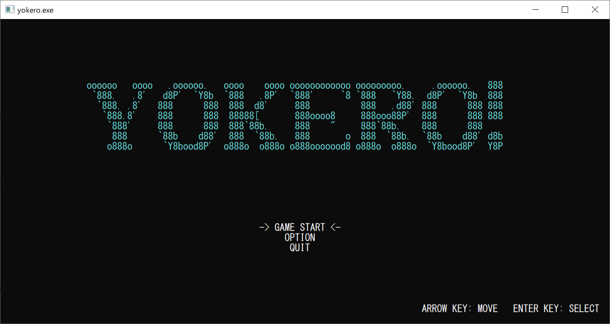
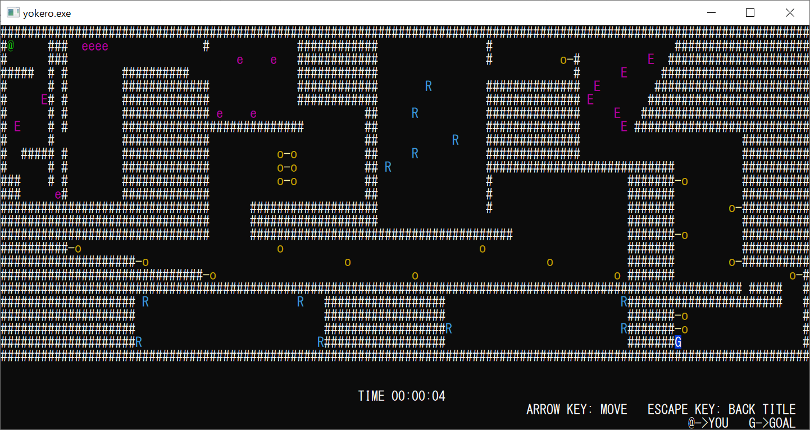

# Console Game "YOKERO!"
コマンドプロンプト上で動作する2Dアクションゲームです。バンダイナムコスタジオのインターンシップで作成した作品になります。

## 起動方法
[リリースページ](https://github.com/takano536/console-game/releases/tag/v1.0)からバイナリをダウンロードすることができます。  
ダウンロード後、zipファイルを展開し`yokero.exe`をダブルクリックしてください。

## 操作方法
#### タイトル

```
* ↑/↓   : メニュー選択
* ENTER : 決定
```
#### ゲーム画面

```
* ↑/→/↓/← : 移動
* ESCAPE  : タイトルに戻る
```

## マップエディット
`map.txt`をテキストエディタなどで編集することで、任意のマップを作成することができます。  
詳しくは`map.txt`を御覧ください。

## ライセンス
本ソフトは無保証です。詳しくは[LICENSE](LICENSE)をご覧ください。
